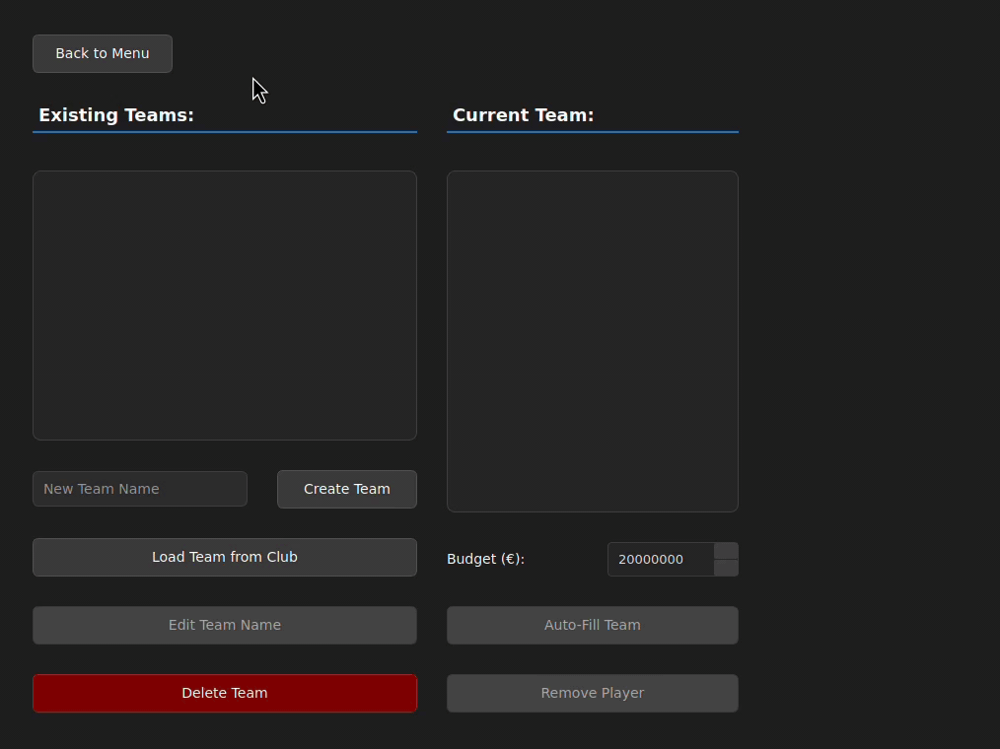
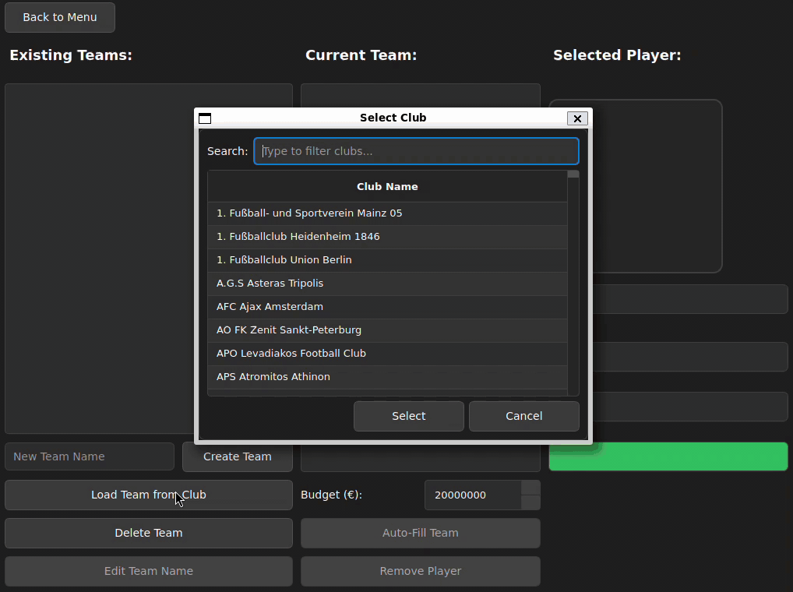

# Elometry

This project introduces Elometry, an application that analyzes football player data from the **Football Data from Transfermarkt dataset**, which includes over 60,000 games, 30,000+ players, 400,000+ player market valuations, and more. The project calculates adapted ELO ratings based on an algorithm [introduced by Wolff et al. in 2020](https://www.researchgate.net/publication/346383793_A_football_player_rating_system) and provides optimal team selection based on these ratings using Integer Linear Programming (ILP).

It is developed in C++ with CMake as the build system. 

## **Features**

### Player ELO Rating Overview
- Calculate player ratings based on match performances
- Adaptive rating system


### Optimal Team Composition
- Integer Linear Programming for team selection
- Optimize players within budget constraints
- Balance performance and market value



### Team Management from Existing Clubs
- Create and manage custom teams based on real data
- Budget-constrained team building based on adapted ELO ratings



## **Project Structure**
```
elometry/
├── CMakeLists.txt
├── cmake/                    # CMake modules
├── db/                       # Database scripts
├── include/                  # Header files
│   ├── gui/                  # User interface headers
│   ├── models/               # Data models
│   ├── services/             # Business logic
│   └── utils/                # Utility classes
├── src/                      # Source code
│   ├── gui/                  # User interface implementation
│   │   ├── components/
│   │   ├── models/
│   │   ├── resources/
│   │   ├── styles/
│   │   └── views/
│   ├── models/               # Implementation of data models
│   ├── services/             # Service implementations
│   └── utils/                # Utility implementations
├── static/                   # Static resources
└── data/                     # Dataset files
```

## **Technology Stack**
- C++20
- Qt6 for GUI
- SQLite for data management
- GLPK for Integer Linear Programming
- OpenMP for parallel processing

## **Prerequisites**

### **Required Tools**
- C++ Compiler (GCC 10+/Clang 10+/MSVC 2019+)
- CMake (3.15 or higher)
- Qt6
- SQLite3
- GLPK (GNU Linear Programming Kit)
- Kaggle CLI tool

## **Installation**
### **Linux (Ubuntu/Debian)**
```bash
sudo apt install build-essential cmake qt6-base-dev libglpk-dev libsqlite3-dev
pip install kaggle
git clone https://github.com/rutgerkool/elometry.git
cd elometry
```

### **macOS**
```bash
brew install cmake qt@6 glpk sqlite
pip install kaggle
git clone https://github.com/rutgerkool/elometry.git
cd elometry
```

## **Building the project**

```bash
mkdir build && cd build
cmake ..
cmake --build .
```

## **Running the project (in `/build`)**

```bash
./Elometry
```

## **Configuration**

### **Kaggle Dataset**
To allow for automated updates, Kaggle API credentials must be submitted in the settings when running the program. 
- Open 'Settings' when running the application
- Enter Kaggle API credentials
  - Kaggle Username
  - Kaggle API Key

*Note: Generate API key from [Kaggle Account Settings](https://www.kaggle.com/)*

## **Performance Optimizations**
- Batch SQL operations
- Indexed queries
- Parallel ELO calculations
- Integer Linear Programming optimization
