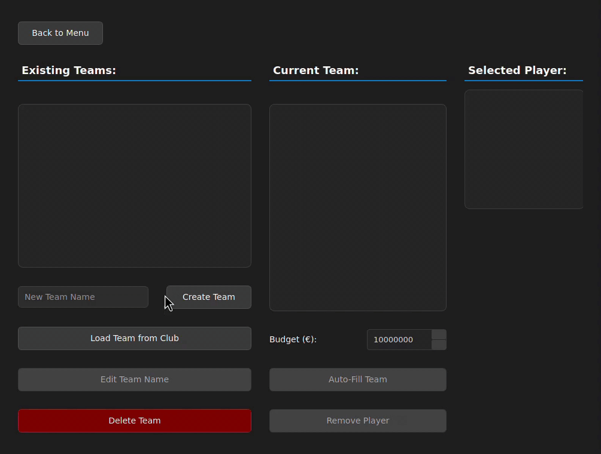

# Elometry

This project introduces Elometry, an application that analyzes football player data from the **Football Data from Transfermarkt dataset**, which includes over 60,000 games, 30,000+ players, 400,000+ player market valuations, and more. The project calculates adapted ELO ratings based on an algorithm [introduced by Wolff et al. in 2020](https://www.researchgate.net/publication/346383793_A_football_player_rating_system) and provides optimal team selection based on these ratings using Integer Linear Programming (ILP).

It is developed in C++ with CMake as the build system.

## **Theory and Approach**

### **Player Rating System**

The core of Elometry is the player rating system, which adapts the traditional ELO rating formula to assess football player performances. The adjusted formula is:

$R' = R + K \times \frac{M}{90} \times \left(1 + \frac{GD}{5}\right) \times (A - E)$

Where:
- $R'$ is the updated player rating
- $R$ is the current player rating
- $K$ is the rating adjustment factor
- $M$ is the minutes played (normalized to a 90-minute match)
- $GD$ is the goal difference impact factor
- $A$ is the actual result (win = 1, draw = 0.5, loss = 0)
- $E$ is the expected outcome based on the opponent's rating

This formula accounts for football-specific factors like playing time, match outcome, and goal difference.

### **Team Optimization with Integer Linear Programming**

The team selection problem is formulated as an optimization challenge with the objective function:

$\max \sum_{i=1}^{n} r_i x_i$

Subject to the constraints:

$\sum_{i=1}^{n} c_i x_i \leq B \quad \text{(Budget Constraint)}$

$\sum_{i \in P_j} x_i = 1, \quad \forall j \quad \text{(Positional Constraints)}$

Where:
- $r_i$ is the rating of player $i$
- $x_i$ is a binary selection variable (1 if selected, 0 otherwise)
- $c_i$ is the cost of player $i$
- $B$ is the available budget
- $P_j$ is the set of players for position $j$

This mathematical approach ensures the best possible team composition within budget constraints while maximizing overall team performance.

## **Features**

### Player ELO Rating Overview
- Calculate player ratings based on match performances
- Adaptive rating system
- Interactive rating history dialog with performance stats
- Comparison functionality to analyze difference in performance between players


### Optimal Team Composition
- Integer Linear Programming for team selection
- Optimize players within budget constraints
- Balance performance and market value


### Team Management from Existing Clubs
- Create and manage custom teams based on real data
- Budget-constrained team building based on adapted ELO ratings
- Track average team rating changes while selecting new players
- Access detailed player rating history from team manager



### Lineup Management using Predefined Formations
- Create and edit lineup formation based on team selection
- Track average lineup rating changes while editing formations
- Analyze rating history from players in the lineup


## **Project Structure**
```
elometry/
├── CMakeLists.txt
├── cmake/                    # CMake modules
├── db/                       # Database scripts
├── include/                  # Header files
│   ├── gui/                  # User interface headers
│   ├── models/               # Data models
│   ├── services/             # Business logic
│   └── utils/                # Utility classes
├── src/                      # Source code
│   ├── gui/                  # User interface implementation
│   │   ├── components/
│   │   │   ├── dialogs/
│   │   │   └── widgets/
│   │   ├── models/
│   │   ├── resources/
│   │   ├── styles/
│   │   └── views/
│   ├── models/               # Implementation of data models
│   ├── services/             # Service implementations
│   └── utils/                # Utility implementations
└── static/                   # Static resources
```

## **Technology Stack**
- C++20
- Qt6 for GUI
- SQLite for data management
- GLPK for Integer Linear Programming
- OpenMP for parallel processing

## **Prerequisites**

### **Required Tools**
- C++ Compiler (GCC 10+/Clang 10+/MSVC 2019+)
- CMake (3.15 or higher)
- Qt6
- SQLite3
- GLPK (GNU Linear Programming Kit)
- CURL for API requests

## **Installation**
### **Linux (Ubuntu/Debian)**
```bash
sudo apt install build-essential cmake qt6-base-dev libglpk-dev libsqlite3-dev libcurl4-openssl-dev libqt6charts6-dev
git clone https://github.com/rutgerkool/elometry.git
cd elometry
```

### **macOS**
```bash
brew install cmake qt@6 glpk sqlite curl
git clone https://github.com/rutgerkool/elometry.git
cd elometry
```

### **Windows**
Windows setup requires several components to be installed separately:

1. **Install Qt6 (MSVC 2022)**
   - Download and install Qt from the [Qt Online Installer](https://www.qt.io/download-qt-installer)
   - Select Qt 6.10.0 for MSVC 2022 64-bit during installation (Custom Installation)
      - Ensure you also select "Qt Charts" during the installation under 'Additional Libraries'
   - Note the installation path (typically `C:\Qt\6.10.0\msvc2022_64`)

2. **Install GLPK**
   - Download GLPK 4.65 from [SourceForge](https://sourceforge.net/projects/winglpk/)
   - Extract the archive to `C:\glpk-4.65`

3. **Install vcpkg and dependencies**
   ```powershell
   cd C:\
   git clone https://github.com/Microsoft/vcpkg.git
   cd vcpkg
   .\bootstrap-vcpkg.bat
   .\vcpkg install sqlite3:x64-windows curl:x64-windows
   ```

4. **Install Visual Studio with C++ Desktop Development workload**
   - Download from [Visual Studio](https://visualstudio.microsoft.com/downloads/)
   - Ensure you select "Desktop development with C++" during installation

5. **Install CMake**
   - Download from [CMake website](https://cmake.org/download/)
   - Add CMake to your system PATH during installation

6. **Clone the repository**
   ```powershell
   git clone https://github.com/rutgerkool/elometry.git
   cd elometry
   ```

## **Building the project**

### **Linux/macOS**
```bash
mkdir build && cd build
cmake ..
cmake --build .
```

### **Windows**
```powershell
mkdir build
cd build
cmake .. -DCMAKE_TOOLCHAIN_FILE=C:/vcpkg/scripts/buildsystems/vcpkg.cmake -DQt6_DIR="C:\Qt\6.10.0\msvc2022_64\lib\cmake\Qt6"
cmake --build . --config Release
```

## **Running the project**

### **Linux/macOS (in `/build`)**
```bash
./Elometry
```

### **Windows (in `/build`)**
```powershell
# Copy necessary DLLs
copy C:\glpk-4.65\w64\glpk_4_65.dll .\Release\
copy C:\vcpkg\installed\x64-windows\bin\sqlite3.dll .\Release\

# Deploy Qt dependencies
C:\Qt\6.10.0\msvc2022_64\bin\windeployqt.exe .\Release\Elometry.exe

# Run the application
.\Release\Elometry.exe
```

## **Configuration**

### **Kaggle Dataset**
To allow for automated updates, Kaggle API credentials must be submitted in the settings when running the program. 
- Open 'Settings' when running the application
- Enter Kaggle API credentials
  - Kaggle Username
  - Kaggle API Key

*Note: Generate API key from [Kaggle Account Settings](https://www.kaggle.com/)*

## **Performance Optimizations**
- **Database Optimization**: Batch operations to minimize query overhead
- **Parallel Processing**: OpenMP distributes player rating calculations across CPU cores
- **Smart ILP Constraints**: Team selection constraints are minimized to only essential positional and budget requirements
- **Pre-filtering**: Players with abnormally low ratings or unrealistic performance-to-cost ratios are filtered before ILP execution
- **Lazy Loading**: The Qt GUI ensures only visible data is loaded in memory
